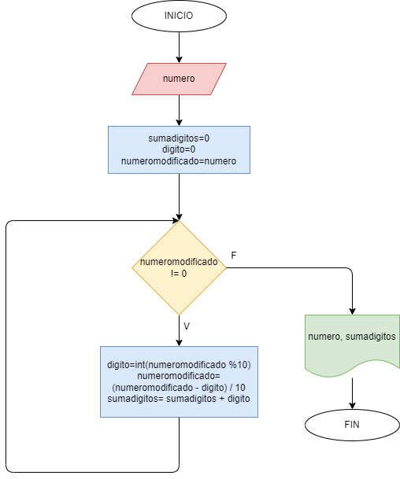

# EJERCICIO 1

Hacer el diagrama de flujo y el programa en python que lea un número n, entero y positivo, de cualquier número de dígitos, que calcule la suma de sus dígitos y que la imprima junto con el numero leído.

## Diagrama de flujo

